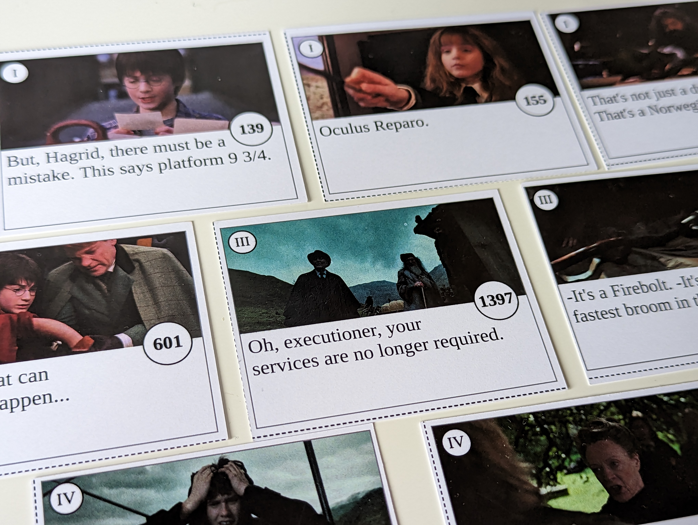
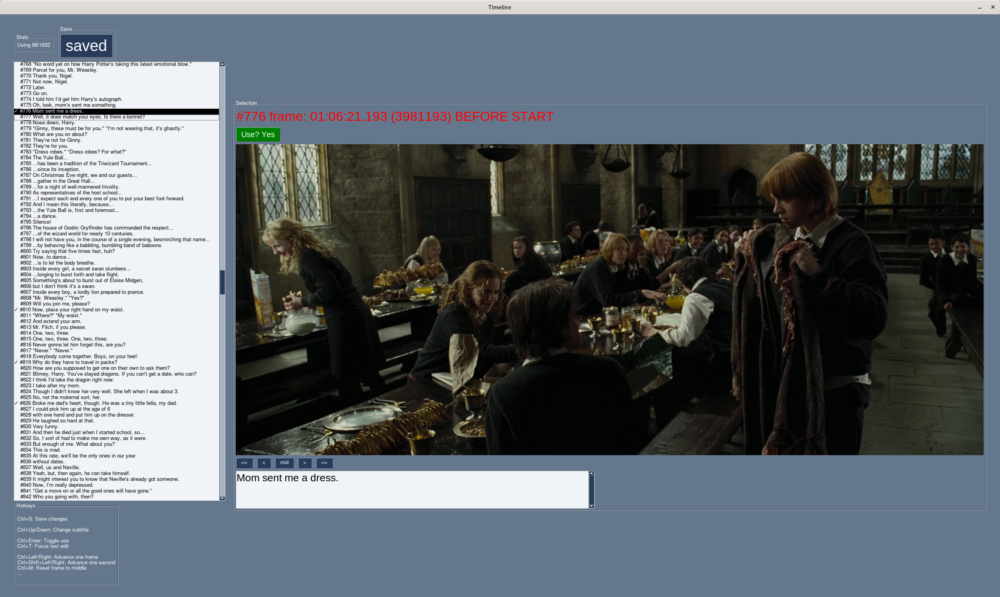
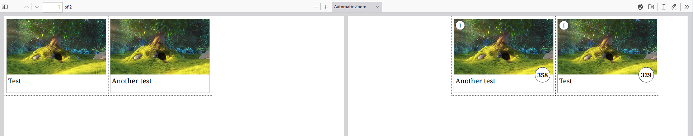

# Timeline card deck generator

This is a collection of hacky scripts that help you create a custom [Timeline card game][bgg-timeline] using the scenes and dialogue from a movie, like the [Timeline: Star Wars][bgg-timeline-sw] game.

Here is an example deck made from the Harry Potter movie series:



## What and why

The Timeline games consist of a deck of cards with some events (historical, inventions, song releases or movie scenes). You play by trying to put them in the right sequence (see Board Game Geek for proper rules).

One time when playing the Star Wars version with friends we thought it would be neat to also have other movie franchises. However it turns out no other movie versions exist. So I decided to make one.

## How it works

The main idea is to take a movie and subtitle file and use that to generate the card images and descriptions.

There is a crude GUI that can be used to go through all of them and adjust the frame (pick something without blur and which shows relevant scene). I tried to make it keyboard driven and fast, but selecting a good set of scenes takes time.



Once the scenes, descriptions and movie frames are selected you can run another script to generate a printable HTML page with the cards. Save that PDF, print it double-sided and cut according to provided cut lines.

Dummy example (sadly I'm not going to share my Harry Potter deck because I don't want to hear from lawyers): [sample.pdf](assets/sample.pdf)


## Instructions

In case you want to use, please be warned that I made this on very short notice: I had two evenings to create it before going on a weekend trip with some friends, and I spent most of that time on the cards, not on the code. So it is not exactly user friendly :)

1. Obtain a movie in format that ffmpeg can read (so basically anything) and a corresponding `.srt` subtitle file.

    ```
    $ MOVIE=/some/path.mkv
    $ SUBS=/some/path.srt
    ```

2. Create a directory for the movie and frame images. The next two steps should be executed from that directory.

    ```
    $ mkdir -p movie1/tmp
    $ cd movie1
    ```

3. Pre-generate frames for all subtitles. This is optional but without it the GUI will be painfully slow at first.

    ```
    $ python3 /path/to/this/repo/bootstrap.py $MOVIE $SUBS
    ```

4. Run the GUI. Use the keyboard shortcuts to navigate between subtitles and select which ones should be used (I recommend ~50-75 per movie, or 300-500 for a whole card deck). You can also change the frame and edit the text if needed.

    ```
    $ python3 /path/to/this/repo/gui.py $MOVIE $SUBS
    ```

5. If you have multiple movies repeat the steps 2-4, putting each one in its own directory.

6. Generate the card deck, passing output directory path and list of all movies you want to include:

    ```
    $ mkdir output
    $ python3 /path/to/this/repo/makecards.py output/ movie1/state.pickle [movie2/state.pickle ...]
    ```

    This are probably a few things you will want to tweak, which are sadly hardcoded but should be easy to edit - just check the source. The main one being the size of the paper and cards you want. Depending on those you will have to edit the dimensions in the CSS rules.

7. Open `output/cards.html`. It has multiple pages on top of each other so it will look broken, but print it to PDF and it should be fine. Double-check the front and back parts are aligned across pages, that the text and card numbers are readable and so on.

# License

MIT for the code.

[bgg-timeline]: https://boardgamegeek.com/boardgame/128664/timeline
[bgg-timeline-sw]: https://boardgamegeek.com/boardgame/183797/timeline-star-wars